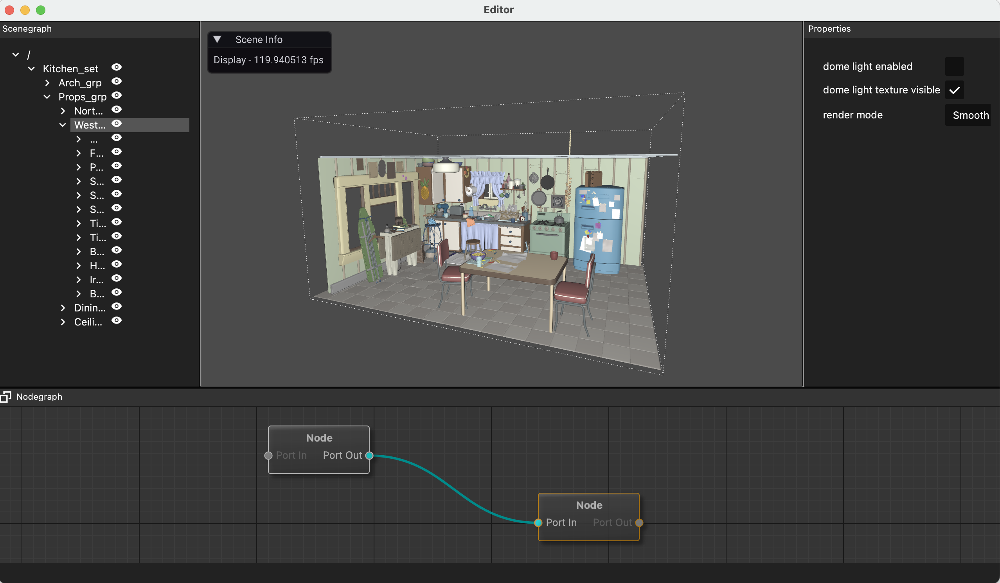

# HydraViewer



HydraViewer is an editor created with OpenUSD hydra storm renderer and Qt6.
UsdViewqt in OpenUSD project is written by pyqt/pyside, but it still use openGL to render the scene.
And I found UsdViewqt is hard to be compiled on Mac.

Apple provide hydra storm renderer powered by Metal. 
This project is aimed to use the hydra storm renderer with modern graphics API like metal.
And I want to combine node system with it. That's why I start this project.

This project is still on very early stage. 
**But if you like it, please let's discuss it through issue or pull request!**

If you'd like to compile by you own. here is the step.
1. Download vcpkg. I use vcpkg to support third_party libs. you can use Clion to install it or by your own.
Then use vcpkg cmake toolchain like
```
cmake -DCMAKE_TOOLCHAIN_FILE=~/.vcpkg-clion/vcpkg/scripts/buildsystems/vcpkg.cmake
```
2. Download OpenUSD and compile without python on Mac:
```
python3 ./OpenUSD/build_scripts/build_usd.py --generator Xcode --no-python ./USDInstall
```
3. I place USDInstall and this project in the same folder, if you are not, find this line in cmake and fix it:
```
${CMAKE_CURRENT_SOURCE_DIR}/../USDInstall
```
4. Install Qt6 library, maybe cmake can't find qt in your compute. You can fix the problem by add qt path in cmake:
````
set(CMAKE_PREFIX_PATH ~/Qt/6.6.1/macos/lib/cmake)
````
After these four step, this project can be compiled well.

